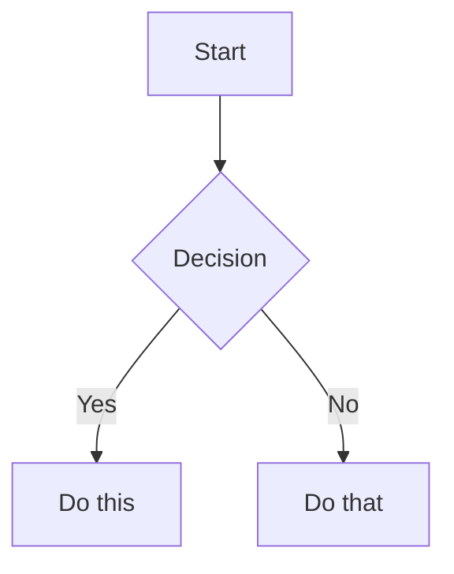

# Appendix E: Obsidian Skills Specification (kepano)

Agent report: complete content from the `kepano/obsidian-skills` repository (18,639 stars). Written by Steph Ango, Obsidian CEO. MIT licensed. This is the most authoritative machine-readable specification of Obsidian's syntax.

---

## Obsidian Flavored Markdown (SKILL.md)

### Workflow: Creating an Obsidian Note

1. **Add frontmatter** with properties (title, tags, aliases) at the top.
2. **Write content** using standard Markdown plus Obsidian-specific syntax.
3. **Link related notes** using wikilinks (`[[Note]]`) for internal vault connections, or standard Markdown links for external URLs.
4. **Embed content** from other notes, images, or PDFs using `![[embed]]` syntax.
5. **Add callouts** for highlighted information using `> [!type]` syntax.
6. **Verify** the note renders correctly in reading view.

> When choosing between wikilinks and Markdown links: use `[[wikilinks]]` for notes within the vault (Obsidian tracks renames automatically) and `[text](url)` for external URLs only.

### Internal Links (Wikilinks)

```
[[Note Name]]                          Link to note
[[Note Name|Display Text]]             Custom display text
[[Note Name#Heading]]                  Link to heading
[[Note Name#^block-id]]                Link to block
[[#Heading in same note]]              Same-note heading link
```

Block IDs defined by appending `^block-id` to any paragraph:

```
This paragraph can be linked to. ^my-block-id
```

For lists and quotes, block ID on separate line after the block:

```
> A quote block

^quote-id
```

### Embeds

```
![[Note Name]]                         Embed full note
![[Note Name#Heading]]                 Embed section
![[image.png]]                         Embed image
![[image.png|300]]                     Embed image with width
![[document.pdf#page=3]]               Embed PDF page
```

### Callouts

```
> [!note]
> Basic callout.

> [!warning] Custom Title
> Callout with a custom title.

> [!faq]- Collapsed by default
> Foldable callout (- collapsed, + expanded).
```

Common types: `note`, `tip`, `warning`, `info`, `example`, `quote`, `bug`, `danger`, `success`, `failure`, `question`, `abstract`, `todo`.

### Properties (Frontmatter)

```yaml
---
title: My Note
date: 2024-01-15
tags:
  - project
  - active
aliases:
  - Alternative Name
cssclasses:
  - custom-class
---
```

Default properties: `tags`, `aliases`, `cssclasses`.

### Tags

```
#tag                    Inline tag
#nested/tag             Nested tag with hierarchy
```

Tags can contain letters, numbers (not first character), underscores, hyphens, and forward slashes.

### Comments

```
This is visible %%but this is hidden%% text.

%%
This entire block is hidden in reading view.
%%
```

### Highlighting

```
==Highlighted text==
```

### Math (LaTeX)

```
Inline: $e^{i\pi} + 1 = 0$

Block:
$$
\frac{a}{b} = c
$$
```

### Diagrams (Mermaid)

````

````

To link nodes to Obsidian notes: `class NodeName internal-link;`

### Footnotes

```
Text with a footnote[^1].
[^1]: Footnote content.
Inline footnote.^[This is inline.]
```

---

## Callouts Reference (CALLOUTS.md)

### Foldable Callouts

```
> [!faq]- Collapsed by default
> This content is hidden until expanded.

> [!faq]+ Expanded by default
> This content is visible but can be collapsed.
```

### Nested Callouts

```
> [!question] Outer callout
> > [!note] Inner callout
> > Nested content
```

### Supported Callout Types

| Type | Aliases | Color / Icon |
|------|---------|-------------|
| `note` | — | Blue, pencil |
| `abstract` | `summary`, `tldr` | Teal, clipboard |
| `info` | — | Blue, info |
| `todo` | — | Blue, checkbox |
| `tip` | `hint`, `important` | Cyan, flame |
| `success` | `check`, `done` | Green, checkmark |
| `question` | `help`, `faq` | Yellow, question mark |
| `warning` | `caution`, `attention` | Orange, warning |
| `failure` | `fail`, `missing` | Red, X |
| `danger` | `error` | Red, zap |
| `bug` | — | Red, bug |
| `example` | — | Purple, list |
| `quote` | `cite` | Gray, quote |

### Custom Callouts (CSS)

```css
.callout[data-callout="custom-type"] {
  --callout-color: 255, 0, 0;
  --callout-icon: lucide-alert-circle;
}
```

---

## Embeds Reference (EMBEDS.md)

### Notes
```
![[Note Name]]
![[Note Name#Heading]]
![[Note Name#^block-id]]
```

### Images
```
![[image.png]]
![[image.png|640x480]]    Width x Height
![[image.png|300]]        Width only (maintains aspect ratio)
```

### External Images
```


```

### Audio
```
![[audio.mp3]]
![[audio.ogg]]
```

### PDF
```
![[document.pdf]]
![[document.pdf#page=3]]
![[document.pdf#height=400]]
```

### Lists
```
![[Note#^list-id]]
```

Where the list has a block ID on a separate line after the block.

### Embedded Search Results
````
```query
tag:#project status:done
```
````

---

## Properties Reference (PROPERTIES.md)

### Property Types

| Type | Example |
|------|---------|
| Text | `title: My Title` |
| Number | `rating: 4.5` |
| Checkbox | `completed: true` |
| Date | `date: 2024-01-15` |
| Date & Time | `due: 2024-01-15T14:30:00` |
| List | `tags: [one, two]` or YAML list |
| Links | `related: "[[Other Note]]"` |

### Default Properties

- `tags` — Note tags (searchable, shown in graph view)
- `aliases` — Alternative names for the note (used in link suggestions)
- `cssclasses` — CSS classes applied to the note in reading/editing view

### Tags

Valid characters: letters (any language), numbers (not first character), underscores `_`, hyphens `-`, forward slashes `/` (for nesting).

---

## JSON Canvas Specification (SKILL.md)

### File Structure

```json
{
  "nodes": [],
  "edges": []
}
```

### Node Types

#### Generic Attributes (all nodes)

| Attribute | Required | Type | Description |
|-----------|----------|------|-------------|
| `id` | Yes | string | Unique 16-char hex identifier |
| `type` | Yes | string | `text`, `file`, `link`, or `group` |
| `x` | Yes | integer | X position in pixels |
| `y` | Yes | integer | Y position in pixels |
| `width` | Yes | integer | Width in pixels |
| `height` | Yes | integer | Height in pixels |
| `color` | No | canvasColor | Preset `"1"`-`"6"` or hex |

#### Text Nodes
- Required: `text` (string with Markdown)
- Use `\n` for line breaks in JSON strings

#### File Nodes
- Required: `file` (path within system)
- Optional: `subpath` (heading or block link, starts with `#`)

#### Link Nodes
- Required: `url` (external URL)

#### Group Nodes
- Optional: `label`, `background` (image path), `backgroundStyle` (`cover`, `ratio`, `repeat`)

### Edges

| Attribute | Required | Default | Description |
|-----------|----------|---------|-------------|
| `id` | Yes | — | Unique identifier |
| `fromNode` | Yes | — | Source node ID |
| `fromSide` | No | — | `top`, `right`, `bottom`, `left` |
| `fromEnd` | No | `none` | `none` or `arrow` |
| `toNode` | Yes | — | Target node ID |
| `toSide` | No | — | `top`, `right`, `bottom`, `left` |
| `toEnd` | No | `arrow` | `none` or `arrow` |
| `color` | No | — | Line color |
| `label` | No | — | Text label |

### Colors

| Preset | Color |
|--------|-------|
| `"1"` | Red |
| `"2"` | Orange |
| `"3"` | Yellow |
| `"4"` | Green |
| `"5"` | Cyan |
| `"6"` | Purple |

### Layout Guidelines
- Coordinates can be negative (canvas extends infinitely)
- `x` increases right, `y` increases down; position is top-left corner
- Space nodes 50-100px apart; 20-50px padding inside groups
- Array order in `nodes` determines z-index (first = bottom)

---

## Obsidian Bases Specification (SKILL.md)

### File Format
`.base` files using YAML with: `filters`, `formulas`, `properties`, `summaries`, `views`.

### View Types
- `table` — Tabular data
- `cards` — Card gallery
- `list` — Simple list
- `map` — Geographic map (requires lat/lng properties)

### Filter Operators
`==`, `!=`, `>`, `<`, `>=`, `<=`, `&&`, `||`, `!`

### Filter Functions
- `file.hasTag("tag")`, `file.hasLink("note")`, `file.inFolder("folder")`

### Formula Functions
- `date()`, `now()`, `today()`, `if()`, `duration()`, `file()`, `link()`
- String: `.contains()`, `.lower()`, `.replace()`, `.split()`
- Number: `.abs()`, `.ceil()`, `.floor()`, `.round()`, `.toFixed()`
- List: `.filter()`, `.map()`, `.reduce()`, `.join()`, `.sort()`, `.unique()`
- Date: `.format()`, `.relative()`, fields: `.year`, `.month`, `.day`
- Duration: `.days`, `.hours`, `.minutes`, `.seconds`

### Default Summary Formulas
Average, Min, Max, Sum, Range, Median, Stddev, Earliest, Latest, Checked, Unchecked, Empty, Filled, Unique

### Embedding
```
![[MyBase.base]]
![[MyBase.base#View Name]]
```

---

## Obsidian CLI (SKILL.md)

### Common Commands
```
obsidian read file="My Note"
obsidian create name="New Note" content="# Hello" template="Template" silent
obsidian append file="My Note" content="New line"
obsidian search query="search term" limit=10
obsidian daily:read
obsidian daily:append content="- [ ] New task"
obsidian property:set name="status" value="done" file="My Note"
obsidian tasks daily todo
obsidian tags sort=count counts
obsidian backlinks file="My Note"
```

### File Targeting
- `file=<name>` — resolves like a wikilink
- `path=<path>` — exact path from vault root

### Plugin Development
```
obsidian plugin:reload id=my-plugin
obsidian dev:errors
obsidian dev:screenshot path=screenshot.png
obsidian dev:dom selector=".workspace-leaf" text
obsidian dev:console level=error
obsidian eval code="app.vault.getFiles().length"
obsidian dev:css selector=".workspace-leaf" prop=background-color
obsidian dev:mobile on
```
