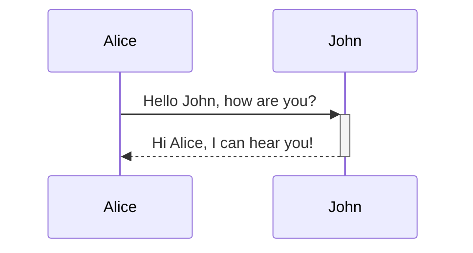

# Obsidian Editor UX Reference

Comprehensive reference extracted from the official Obsidian Help documentation
(https://help.obsidian.md). Source of truth for Corbomite's reading mode and
editor behavior.

---

## Table of Contents

1. [Views and Editing Modes](#1-views-and-editing-modes)
2. [Basic Formatting Syntax](#2-basic-formatting-syntax)
3. [Advanced Formatting Syntax](#3-advanced-formatting-syntax)
4. [Obsidian Flavored Markdown](#4-obsidian-flavored-markdown)
5. [Internal Links](#5-internal-links)
6. [Embedding Files](#6-embedding-files)
7. [Aliases](#7-aliases)
8. [Callouts](#8-callouts)
9. [Tags](#9-tags)
10. [Properties (Frontmatter)](#10-properties-frontmatter)
11. [Folding](#11-folding)
12. [HTML Content](#12-html-content)
13. [Accepted File Formats](#13-accepted-file-formats)
14. [Keyboard Shortcuts — Editing](#14-keyboard-shortcuts--editing)
15. [Multiple Cursors](#15-multiple-cursors)
16. [Hotkeys (Customizable Commands)](#16-hotkeys-customizable-commands)
17. [Search](#17-search)
18. [Tabs and Workspace](#18-tabs-and-workspace)
19. [Command Palette and Quick Switcher](#19-command-palette-and-quick-switcher)
20. [Sidebar, Ribbon, Status Bar](#20-sidebar-ribbon-status-bar)
21. [Backlinks and Outline](#21-backlinks-and-outline)

---

## 1. Views and Editing Modes

Obsidian has two **views** and two **editing modes**:

### Reading View
- Shows the note without Markdown syntax — clean, rendered output.
- Toggle: click the view switcher icon in the upper-right, or press `Ctrl+E` (`Cmd+E` on macOS).
- Status bar also has an interactive icon to switch views.
- Hold `Ctrl`/`Cmd` and click the view switcher to open side-by-side editing + reading view.

### Editing View — Live Preview (default)
- Formatted text shown inline; Markdown syntax is hidden UNTIL the cursor enters that formatted region.
- When the cursor touches bold text, you see `**bold**`; when the cursor leaves, you see rendered **bold**.
- Toggle with `Ctrl+E` / the view switcher / command palette "Toggle Reading view".
- Default editing mode (configurable in Settings > Editor > Default editing mode).

### Editing View — Source Mode
- Shows ALL Markdown syntax exactly as written, at all times. No inline rendering.
- Toggle via status bar icon or command palette "Toggle Live Preview/Source mode".
- You can set a hotkey for quick toggling between Live Preview and Source mode.

### Key Behaviors
- Default view for new tabs is configurable (Settings > Editor > Default view for new tabs).
- `Ctrl+E` cycles: Editing (Live Preview) -> Reading -> Editing (Live Preview).
- Source mode must be explicitly selected from the status bar or command palette.

---

## 2. Basic Formatting Syntax

### Paragraphs
- Blank line separates paragraphs.
- Multiple adjacent blank spaces and multiple newlines collapse to single space/paragraph break in reading view.
- Use `&nbsp;` for non-breaking spaces or `<br>` for line breaks in HTML.

### Line Breaks
- Default: pressing `Enter` once creates a new line in the editor but is treated as continuation of the same paragraph in rendered output (standard Markdown soft wrap).
- To insert a line break within a paragraph:
  - Add **two trailing spaces** at end of line before `Enter`, OR
  - Use `Shift+Enter` to directly insert a line break.
- **Strict Line Breaks** setting (Settings > Editor > Strict Line Breaks):
  - When enabled, single `Enter` with no trailing spaces = lines merge into one.
  - Single `Enter` with 2+ trailing spaces = line break (`<br>`), same paragraph.
  - Double `Enter` = separate paragraphs (`<p>` elements).

### Headings
```
# Heading 1
## Heading 2
### Heading 3
#### Heading 4
##### Heading 5
###### Heading 6
```
- 1-6 `#` symbols before heading text.
- Headings appear in the Outline plugin sidebar.

### Bold, Italic, Strikethrough, Highlight

| Style | Syntax | Example |
|---|---|---|
| Bold | `**text**` or `__text__` | **Bold text** |
| Italic | `*text*` or `_text_` | *Italic text* |
| Strikethrough | `~~text~~` | ~~Striked out text~~ |
| Highlight | `==text==` | ==Highlighted text== |
| Bold + nested italic | `**bold _italic_ bold**` | Mixed |
| Bold + italic | `***text***` or `___text___` | Both |

- Escape with backslash: `\*\*not bold\*\*`

### Internal Links
Two supported formats:
- Wikilink: `[[Three laws of motion]]`
- Markdown: `[Three laws of motion](Three%20laws%20of%20motion.md)`

### External Links
```
[Obsidian Help](https://help.obsidian.md)
```
- Escape spaces in URLs with `%20` or wrap URL in angle brackets: `[Note](<obsidian://open?vault=MainVault&file=My Note.md>)`
- Obsidian URI links: `[Note](obsidian://open?vault=MainVault&file=Note.md)`

### External Images
```

```
- Resize: `` — width x height.
- Width only: `` — scales proportionally.

### Blockquotes
```
> Quoted text here.
```
- Can be turned into callouts by adding `[!info]` as first line.

### Lists

**Unordered:** prefix with `-`, `*`, or `+`
```
- Item 1
- Item 2
```

**Ordered:** number followed by `.` or `)`
```
1. Item 1
2. Item 2
```
or
```
1) Item 1
2) Item 2
```

**Task lists:**
```
- [x] Completed task
- [ ] Incomplete task
```
- Clicking checkbox in Reading view toggles completion.
- Any character inside brackets marks as complete: `- [?]`, `- [-]`, etc.

**Nesting:** indent with `Tab` / `Shift+Tab`. Can mix ordered, unordered, and task lists.
```
1. First
   1. Nested ordered
2. Second
   - Nested unordered
```

### Horizontal Rule
Three or more of: `***`, `---`, `___` (with or without spaces between characters).

### Inline Code
```
Text inside `backticks` is code.
```
- For backticks inside inline code, use double backticks: ``` ``code with ` inside`` ```

### Code Blocks
- Fenced with 3+ backticks or 3+ tildes.
- Language specifier after opening fence for syntax highlighting: ````js`
- Indented code blocks: 4 spaces or `Tab`.
- **Nesting code blocks:** outer fence must use MORE fence characters than inner, or different fence type (backticks vs tildes).
- Obsidian uses **PrismJS** for syntax highlighting in Reading view.
- Source mode and Live Preview do NOT use PrismJS — may render differently.

### Footnotes
```
Text with footnote[^1].

[^1]: Footnote content.
[^2]: Multi-line footnote.
  Indent continuation with 2 spaces.
[^note]: Named footnotes still render as numbers.
```

**Inline footnotes:**
```
Inline footnote.^[This is an inline footnote.]
```
- NOTE: Inline footnotes only work in Reading view, NOT in Live Preview.

### Comments
```
This is an %%inline%% comment.

%%
This is a block comment.
Block comments span multiple lines.
%%
```
- Comments are only visible in Editing view.

### Escaping Markdown
- Backslash before special characters: `\*`, `\_`, `\#`, `` \` ``, `\|`, `\~`
- For ordered lists, escape the period: `1\. Not a list item`

---

## 3. Advanced Formatting Syntax

### Tables
```
| First name | Last name |
| ---------- | --------- |
| Max        | Planck    |
| Marie      | Curie     |
```
- Outer pipes optional but recommended.
- Header row must have at least 2 hyphens per column.
- Alignment with colons: `:--` left, `:--:` center, `--:` right.
- In Live Preview: right-click table for context menu to add/delete columns/rows, sort, move.
- Insert via Command Palette "Insert Table" or right-click > Insert > Table.
- Pipe characters inside table cells (for aliases, image resize) must be escaped: `\|`.
- Tables support inline formatting: bold, italic, internal links, embeds.

### Diagrams (Mermaid)
````

````
- Uses Mermaid.js. Supports: flowcharts, sequence diagrams, timelines, and more.
- Internal links in diagrams: apply `internal-link` class to nodes.
  ```
  class Biology,Chemistry internal-link;
  ```
- Internal links from diagrams do NOT show in Graph view.
- Special characters in node names require double quotes: `A["special char"]`.

### Math (MathJax/LaTeX)
**Block math:**
```
$$
\begin{vmatrix}a & b\\
c & d
\end{vmatrix}=ad-bc
$$
```

**Inline math:**
```
This is inline $e^{2i\pi} = 1$.
```
- Uses MathJax with LaTeX notation.
- Dollar signs: `$$` for block, `$` for inline.
- Reference: MathJax basic tutorial, TeX/LaTeX extension list.

---

## 4. Obsidian Flavored Markdown

Obsidian supports: **CommonMark** + **GitHub Flavored Markdown** + **LaTeX**.

### Obsidian-Specific Extensions

| Syntax | Feature |
|---|---|
| `[[Link]]` | Internal links (wikilinks) |
| `![[Link]]` | File embeds |
| `![[Link#^id]]` | Block reference embeds |
| `^id` | Block identifier definition |
| `[^id]` | Footnotes |
| `%%Text%%` | Comments (editing view only) |
| `~~Text~~` | Strikethrough |
| `==Text==` | Highlights |
| ` ``` ` | Code blocks |
| `- [ ]` | Incomplete task |
| `- [x]` | Completed task |
| `> [!note]` | Callouts |
| Tables | GFM tables |

### Critical Rule: No Markdown Inside HTML
- Obsidian does NOT render Markdown syntax inside HTML elements (`<div>`, `<span>`, `<table>`, etc.).
- This is intentional for performance with large documents.
- Exception: Some inline HTML tags like `<span>` or `<a>` may appear to work, but the Markdown is being processed outside the HTML context.

---

## 5. Internal Links

### Supported Formats
- **Wikilink:** `[[Three laws of motion]]` or `[[Three laws of motion.md]]`
- **Markdown:** `[Three laws of motion](Three%20laws%20of%20motion)` or `[Three laws of motion](Three%20laws%20of%20motion.md)`
- Default: Wikilink (can disable in Settings > Files and Links > Use [[Wikilinks]]).
- Even with Wikilinks disabled, typing `[[` triggers autocomplete and generates Markdown links.

### Invalid Characters in Links
`# | ^ : %% [[ ]]` — avoid in filenames.

### Link Creation
- Type `[[` and select from suggestions.
- Select text then type `[[`.
- Command palette: "Add internal link".

### Link to Heading
- Same note: `[[#Heading Name]]` — type `[[#` for autocomplete.
- Another note: `[[Note Name#Heading Name]]`
- Subheadings: `[[Note#H2#H3]]` — chain with multiple `#`.
- Vault-wide heading search: `[[## search term]]` — double hash.

### Link to Block
- Syntax: `[[Note#^block-id]]`
- Type `#^` to get block suggestions.
- Block = paragraph, blockquote, list item, etc.
- Block IDs for simple paragraphs: `^block-id` at end of line (space before caret).
- Block IDs for structured blocks (lists, quotes, callouts, tables): on separate line with blank lines before and after.
- Block IDs for list items: can be placed directly on a bullet point line.
- Human-readable IDs: `^quote-of-the-day` — Latin letters, numbers, dashes only.
- Vault-wide block search: `[[^^search term]]` — double caret.
- WARNING: Block references are Obsidian-specific, not standard Markdown.

### Display Text (Aliases in Links)
- Wikilink: `[[Note|Display Text]]`
- Markdown: `[Display Text](Note.md)`
- Heading links: `[[Note#Heading|Display Text]]`

### Preview Linked File
- Requires Page Preview plugin.
- Hover over link in editing mode while holding `Ctrl`/`Cmd` to see preview popup.

### Auto-Update
- Obsidian auto-updates internal links when files are renamed (configurable).

---

## 6. Embedding Files

Prefix an internal link with `!` to embed:

### Embed a Note
```
![[Internal links]]
```

### Embed a Heading or Block
```
![[Note#Heading]]
![[Note#^block-id]]
```

### Embed an Image
```
![[image.jpg]]
```
- Resize: `![[image.jpg|640x480]]` or width only: `![[image.jpg|100]]`
- External image embed with resize: ``

### Embed Audio
```
![[audio.ogg]]
```

### Embed PDF
```
![[Document.pdf]]
```
- Specific page: `![[Document.pdf#page=3]]`
- Custom height: `![[Document.pdf#height=400]]`

### Embed a List
- Add block ID to list, then embed: `![[Note#^my-list-id]]`

### Embed Search Results
````
```query
search terms here
```
````

### Drag and Drop
- On desktop, drag supported files directly into a note to embed automatically.

---

## 7. Aliases

Aliases are alternative names for a note, defined in frontmatter:
```yaml
---
aliases:
  - Doggo
  - Woofer
  - Yapper
---
```

- When typing `[[`, aliases appear in suggestions with a curved arrow icon.
- Selecting an alias creates: `[[Actual Note Name|Alias]]` — preserves interoperability.
- Backlinks plugin can find unlinked mentions of aliases.

---

## 8. Callouts

### Syntax
```
> [!info] Optional Title
> Callout body content.
> Supports **Markdown**, [[Wikilinks]], and embeds.
```

### Title
- Default title = type identifier in title case.
- Custom title: text after type identifier.
- Title-only (no body): `> [!tip] Title only`

### Foldable Callouts
- `> [!faq]- Collapsed by default` (minus sign)
- `> [!faq]+ Expanded by default` (plus sign)

### Nested Callouts
```
> [!question] Can callouts be nested?
> > [!todo] Yes!
> > > [!example] Multiple layers.
```

### Supported Types and Aliases

| Type | Aliases |
|---|---|
| `note` | (default for unsupported types) |
| `abstract` | `summary`, `tldr` |
| `info` | — |
| `todo` | — |
| `tip` | `hint`, `important` |
| `success` | `check`, `done` |
| `question` | `help`, `faq` |
| `warning` | `caution`, `attention` |
| `failure` | `fail`, `missing` |
| `danger` | `error` |
| `bug` | — |
| `example` | — |
| `quote` | `cite` |

- Type identifier is case-insensitive.
- In Live Preview, right-click callout name to change type.
- Insert via Command Palette: "Insert callout" (wraps selected text).
- Custom callouts via CSS snippets:
  ```css
  .callout[data-callout="my-type"] {
      --callout-color: 0, 0, 0;
      --callout-icon: lucide-alert-circle;
  }
  ```

---

## 9. Tags

### Syntax
- Inline: `#meeting` — hash followed by keyword.
- In frontmatter:
  ```yaml
  ---
  tags:
    - recipe
    - cooking
  ---
  ```

### Nested Tags
- Forward slashes: `#inbox/to-read`, `#inbox/processing`
- Searching `tag:inbox` matches `#inbox` and all nested like `#inbox/to-read`.
- Tags view shows nested tags under parent.

### Tag Format Rules
- Allowed: letters, numbers, `_`, `-`, `/`, Unicode (including emoji).
- Must contain at least one non-numerical character (`#1984` invalid, `#y1984` valid).
- Case-insensitive (`#tag` == `#TAG`). Display uses casing of first creation.
- No blank spaces. Use camelCase, PascalCase, snake_case, or kebab-case.

### Finding Tags
- Search plugin: `tag:#meeting`
- Click on tags in notes.
- Tags view plugin: "Tags: Show tags" command.

---

## 10. Properties (Frontmatter)

### Adding Properties
- Command: "Add file property" or `Cmd/Ctrl+;`.
- Three-dot menu > "Add file property".
- Type `---` at very beginning of file.

### Format
```yaml
---
name: value
---
```
- YAML format at top of file.
- Each property name must be unique within a note.
- JSON also supported (read, interpreted, saved as YAML).

### Property Types
| Type | Description |
|---|---|
| Text | Single line, no Markdown rendering. URLs and `[[Links]]` supported (must be quoted). |
| List | Multiple values, each on own line with `- ` prefix. |
| Number | Literal integers or decimals. |
| Checkbox | `true` / `false`. Renders as checkbox in Live Preview. |
| Date | `2020-08-21` format. Links to Daily Note if plugin enabled. |
| Date & time | `2020-08-21T10:30:00` format. |
| Tags | Special type for `tags` property only. List format. |

- Once a type is assigned to a property name, ALL properties with that name vault-wide use same type.

### Default Properties

| Property | Type | Purpose |
|---|---|---|
| `tags` | List | Tags for the note |
| `aliases` | List | Alternative names |
| `cssclasses` | List | CSS classes for styling individual notes |

### Publish Properties
`publish`, `permalink`, `description`, `image`, `cover`

### Deprecated (since 1.4, dropped in 1.9)
`tag` -> `tags`, `alias` -> `aliases`, `cssclass` -> `cssclasses`

### Property Hotkeys

| Action | Hotkey |
|---|---|
| Add new property | `Cmd/Ctrl+;` |
| Focus next property | `Down` or `Tab` |
| Focus previous property | `Up` or `Shift+Tab` |
| Jump to editor | `Alt+Down` |
| Extend selection up/down | `Shift+Up/Down` |
| Select all | `Cmd/Ctrl+A` |
| Edit property name | `Left` |
| Edit property value | `Right` |
| Focus property | `Escape` |
| Delete property | `Cmd/Ctrl+Backspace` |
| Undo/Redo | `Cmd/Ctrl+Z` / `Cmd/Ctrl+Shift+Z` |

### Vim Keys in Properties
| Action | Key |
|---|---|
| Move down/up | `j`/`k` |
| Focus key/value | `h`/`l` |
| Focus value (end) | `A` |
| Focus value (begin) | `i` |
| Create new property | `o` |

### Display Modes
- **Visible** (default) — shows properties at top.
- **Hidden** — hides from note, viewable in sidebar.
- **Source** — shows raw YAML.

### Search Properties
- `[property]` — files with that property.
- `[property:value]` — files with that property and value.
- `[property:null]` — property exists but has no value.
- Supports sub-queries, OR, exact match, regex.

### Limitations
- No nested properties (use Source mode to view).
- No bulk editing (use external tools).
- No Markdown in property values (intentional).

---

## 11. Folding

- Fold headings and indented lists by hovering and clicking the arrow on the left.
- Folded sections always show the arrow indicator.
- Configurable: Settings > Editor > "Fold indent" / "Fold heading".
- Command palette:
  - "Fold all headings and lists"
  - "Unfold all headings and lists"
- Assignable hotkeys:
  - **Fold more** — folds the section/list containing cursor.
  - **Fold less** — unfolds the section at cursor.

---

## 12. HTML Content

### Supported
- Obsidian supports HTML in notes.
- HTML is **sanitized** — `<script>` elements are stripped for security.
- Common uses:
  - Comments: `<!-- HTML comment -->`
  - Underline: `<u>text</u>`
  - Span/Div with custom CSS: `<span style="font-family: cursive">text</span>`
  - Strikethrough: `<s>text</s>`
  - `<iframe>` for embedding web pages.

### Critical Limitations
1. **No Markdown inside HTML.** Markdown syntax like `**bold**` is NOT processed inside `<div>`, `<span>`, `<table>`, or any HTML tags. Intentional design choice.
2. **HTML blocks must be self-contained.** No blank lines within HTML blocks — blank lines break the HTML block.
3. Inline tags like `<span>` may appear to render Markdown, but the Markdown is processed outside the HTML context.

---

## 13. Accepted File Formats

| Type | Extensions |
|---|---|
| Markdown | `.md` |
| Bases | `.base` |
| JSON Canvas | `.canvas` |
| Images | `.avif`, `.bmp`, `.gif`, `.jpeg`, `.jpg`, `.png`, `.svg`, `.webp` |
| Audio | `.flac`, `.m4a`, `.mp3`, `.ogg`, `.wav`, `.webm`, `.3gp` |
| Video | `.mkv`, `.mov`, `.mp4`, `.ogv`, `.webm` |
| PDF | `.pdf` |

- Links to non-Markdown formats need file extension: `[[Figure 1.png]]`.
- Community plugins can extend supported formats.
- Audio/video support depends on device codecs.

---

## 14. Keyboard Shortcuts -- Editing

These are OS/framework-provided shortcuts, NOT customizable in Obsidian.

### Windows and Linux

#### Common Actions
| Action | Shortcut |
|---|---|
| Copy | `Ctrl+C` |
| Cut | `Ctrl+X` |
| Paste | `Ctrl+V` |
| Paste without formatting | `Ctrl+Shift+V` |
| Undo | `Ctrl+Z` |
| Redo | `Ctrl+Shift+Z` or `Ctrl+Y` |
| Copy paragraph (no selection) | `Ctrl+C` |
| Cut paragraph (no selection) | `Ctrl+X` |

#### Text Editing
| Action | Shortcut |
|---|---|
| New line | `Enter` |
| Delete previous character | `Backspace` |
| Delete next character | `Delete` |
| Delete previous word | `Ctrl+Backspace` |
| Delete next word | `Ctrl+Delete` |
| Delete current line (no selection) | `Ctrl+Shift+K` |

#### Text Navigation
| Action | Shortcut |
|---|---|
| Move one character | `Left`/`Right` |
| Move to beginning of previous word | `Ctrl+Left` |
| Move to end of next word | `Ctrl+Right` |
| Move to beginning of line | `Home` |
| Move to end of line | `End` |
| Move to previous/next line | `Up`/`Down` |
| Move to beginning of note | `Ctrl+Home` |
| Move to end of note | `Ctrl+End` |
| Move up/down one page | `Page Up`/`Page Down` |

#### Text Selection
| Action | Shortcut |
|---|---|
| Simplify selection | `Escape` |
| Select all | `Ctrl+A` |
| Extend selection one character | `Shift+Left/Right` |
| Extend to beginning of previous word | `Ctrl+Shift+Left` |
| Extend to end of next word | `Ctrl+Shift+Right` |
| Extend to beginning of line | `Shift+Home` |
| Extend to end of line | `Shift+End` |
| Extend to beginning of note | `Ctrl+Shift+Home` |
| Extend to end of note | `Ctrl+Shift+End` |
| Extend one page up/down | `Shift+Page Up/Down` |

### macOS

#### Common Actions
| Action | Shortcut |
|---|---|
| Copy | `Cmd+C` |
| Cut | `Cmd+X` |
| Paste | `Cmd+V` |
| Paste without formatting | `Cmd+Shift+V` |
| Undo | `Cmd+Z` |
| Redo | `Cmd+Shift+Z` |
| Copy paragraph (no selection) | `Cmd+C` |
| Cut paragraph (no selection) | `Cmd+X` |

#### Text Formatting (macOS only documented)
| Action | Shortcut |
|---|---|
| Bold | `Cmd+B` |
| Italic | `Cmd+I` |

#### Text Editing
| Action | Shortcut |
|---|---|
| New line | `Enter` |
| Delete previous character | `Backspace` |
| Delete next character | `Delete` |
| Delete previous word | `Option+Backspace` |
| Delete next word | `Option+Delete` |
| Delete to beginning of line | `Cmd+Backspace` |
| Delete to end of line | `Cmd+Delete` |
| Delete current line (no selection) | `Cmd+Shift+K` |

#### Text Navigation
| Action | Shortcut |
|---|---|
| Move one character | `Left`/`Right` |
| Move to beginning of previous word | `Option+Left` |
| Move to end of next word | `Option+Right` |
| Move to beginning of line | `Cmd+Left` |
| Move to end of line | `Cmd+Right` |
| Move up/down line | `Up`/`Down` |
| Move to beginning of note | `Cmd+Up` |
| Move to end of note | `Cmd+Down` |
| Move up/down one page | `Fn+Up`/`Fn+Down` |

#### Text Selection
| Action | Shortcut |
|---|---|
| Simplify selection | `Escape` |
| Select all | `Cmd+A` |
| Extend one character | `Shift+Left/Right` |
| Extend to beginning of previous word | `Option+Shift+Left` |
| Extend to end of next word | `Option+Shift+Right` |
| Extend to beginning of line | `Cmd+Shift+Left` |
| Extend to end of line | `Cmd+Shift+Right` |
| Extend to beginning of note | `Cmd+Shift+Up` |
| Extend to end of note | `Cmd+Shift+Down` |
| Extend one page up/down | `Ctrl+Shift+Up/Down` |

---

## 15. Multiple Cursors

- **Add cursor:** Hold `Alt` (or `Option` on macOS) and click at another position.
- **Remove all extra cursors:** Click anywhere without holding a key, or press `Escape`.
- **Rectangular/column selection:** Hold `Shift+Alt` (`Shift+Option` on macOS) while dragging. OR hold middle mouse button while dragging.

---

## 16. Hotkeys (Customizable Commands)

- Hotkeys are customizable keyboard shortcuts for Obsidian commands.
- Different from OS-level editing shortcuts (which cannot be customized).
- Manage in Settings > Hotkeys.
- Can assign multiple hotkey combinations to a single command.
- Non-US keyboard layouts: hotkeys work based on physical keys pressed.

### Notable Default Hotkeys
| Action | Windows/Linux | macOS |
|---|---|---|
| Command palette | `Ctrl+P` | `Cmd+P` |
| Quick switcher | `Ctrl+O` | `Cmd+O` |
| Search | `Ctrl+Shift+F` | `Cmd+Shift+F` |
| Toggle reading view | `Ctrl+E` | `Cmd+E` |
| New tab | `Ctrl+T` | `Cmd+T` |
| Add property | `Ctrl+;` | `Cmd+;` |

---

## 17. Search

### Opening Search
- Default: left sidebar icon.
- Keyboard: `Ctrl+Shift+F` / `Cmd+Shift+F`.
- With text selected: opens search pre-filled with that text.

### Search Terms
- Words matched independently. "meeting work" = files with BOTH.
- `OR` operator: "meeting OR work" = files with EITHER.
- Exact phrase: `"star wars"` (quotes).
- Escaped quotes inside phrases: `"they said \"hello\""`.
- Parentheses for grouping: `meeting (work OR meetup) personal`.
- Negation with `-`: `meeting -work`.
- Comparison operators in brackets: `[duration:<5]`, `[duration:>5]`.

### Search Operators
| Operator | Description |
|---|---|
| `file:` | Match filename (any file type) |
| `path:` | Match file path (any file type) |
| `content:` | Match file content |
| `match-case:` | Case-sensitive match |
| `ignore-case:` | Case-insensitive match |
| `tag:` | Match tag (ignores code blocks) |
| `line:` | All words on same line |
| `block:` | All words in same block |
| `section:` | All words in same section (between headings) |
| `task:` | Match in any task |
| `task-todo:` | Match in uncompleted task |
| `task-done:` | Match in completed task |

- Operators support nested sub-queries: `task:(call OR email)`.

### Property Search
- `[property]` — has property.
- `[property:value]` — has property with value.
- `[property:null]` — property exists but empty.
- Supports OR, quotes, regex.

### Regular Expressions
- Surround with `/`: `/\d{4}-\d{2}-\d{2}/`
- Combinable with operators: `path:/\d{4}-\d{2}-\d{2}/`
- JavaScript-flavored regex.

### Search Settings
| Setting | Description |
|---|---|
| Explain search term | Shows plain-text explanation |
| Collapse results | Toggle context display |
| Show more context | Expand surrounding text |

### Sort Orders
File name (A-Z), File name (Z-A), Modified time (new-old), Modified time (old-new), Created time (new-old), Created time (old-new).

### Embed Search Results
````
```query
embed OR search
```
````

---

## 18. Tabs and Workspace

### Tabs
- Open new tab: `Ctrl+T` / `Cmd+T`.
- Close tab: standard close button.
- Switch tabs: `Ctrl+Tab` (next), `Ctrl+Shift+Tab` (previous).
- Jump to tab: `Ctrl+1` through `Ctrl+9` (first through last).
- Reopen closed tab: `Ctrl+Shift+T` / `Cmd+Shift+T`.

### Opening Links with Modifiers

| Action | macOS | Windows/Linux |
|---|---|---|
| Navigate (same tab) | (none) | (none) |
| New tab | `Cmd` (+`Shift` in Source Mode) | `Ctrl` (+`Shift` in Source Mode) |
| New tab group | `Cmd+Option` | `Ctrl+Alt` |
| New window | `Cmd+Option+Shift` | `Ctrl+Alt+Shift` |

### Tab Groups
- Drag tabs to split into new tab groups (right or down).
- Right-click tab > "Split right" or "Split down".
- Resize by dragging edges.

### Pinned Tabs
- Right-click > Pin. Links from pinned tabs open in separate tabs.

### Stacked Tabs
- Tab group dropdown > "Stack notes" — sliding/overlapping tab layout.

### Linked Views
- Open via three-dot menu > "Open linked view".
- Available: Graph view (local), Backlinks, Outline.
- Updates automatically when referenced tab content changes.

### Workspace
- Desktop: Ribbon (left) + Left sidebar + Right sidebar + Central tab groups + Status bar.
- Mobile: Tabs + Sidebars (swipe) + Navigation bar + Ribbon menu.
- Save/restore layouts with Workspaces plugin.

---

## 19. Command Palette and Quick Switcher

### Command Palette
- Open: `Ctrl+P` / `Cmd+P`.
- Fuzzy matching: "scf" finds "Save current file".
- Recently used commands appear at top (since v1.8.3).
- Pin frequently used commands in Settings > Command palette.

### Quick Switcher
- Open: `Ctrl+O` / `Cmd+O`.
- Search notes by name or alias.
- `Enter` to open, `Shift+Enter` to create new note with exact name.
- `Ctrl+Enter` / `Cmd+Enter` to open in new tab.
- Empty search shows recent notes — quick toggle between two notes.
- Switches to simpler algorithm at 10,000+ vault items.

---

## 20. Sidebar, Ribbon, Status Bar

### Sidebars
- Left and right sidebars, collapsible.
- Contain plugin tabs (Backlinks, Outgoing links, File explorer, etc.).
- Desktop: drag notes into sidebar.
- Mobile: swipe left/right to open.
- Tabs can be pinned:
  - Pinned notes stay in place.
  - Pinned panes (Backlinks, etc.) stay focused on last selected note.

### Ribbon
- Left side of window (desktop), always visible even when sidebar collapsed.
- Default actions: Vault switcher, Help, Settings.
- Customizable: drag to reorder, right-click to hide/show actions.
- Can be hidden entirely (Settings > Appearance > Show ribbon).
- Mobile: accessible via Menu icon in Navigation bar.

### Status Bar
- Bottom right corner.
- Shows: backlink count, current editor view mode, word/character count.
- Some items clickable (e.g., Sync status), some informational only.
- Items added by core and community plugins.

---

## 21. Backlinks and Outline

### Backlinks
- Shows all notes linking TO the active note.
- **Linked mentions:** notes with explicit internal links.
- **Unlinked mentions:** notes containing the note's name as plain text.
- Options: collapse results, show more context, sort order, search filter.
- Open via right sidebar Backlinks tab or command "Backlinks: Show backlinks".
- Linked backlinks tab: stays focused on specific note regardless of active tab.
- Inline backlinks: "Backlinks: Toggle backlinks in document" shows at bottom of note.

### Outline
- Lists all headings in the active note.
- Click heading to navigate.
- Drag headings to rearrange sections in the note.
