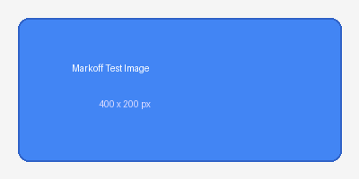

# Markoff Feature Showcase

This document exercises every rendering feature implemented so far.

## Inline Formatting

Here is **bold text**, *italic text*, ~~strikethrough~~, and `inline code`.
You can combine them: ***bold italic***, **bold with `code` inside**.

Here is ==highlighted text== that should have a yellow background. gdf This works.

Okay, interesting. 

This has a %%hidden comment%% that disappears in reading view.

Tags work too: #project/markoff and #demo are styled distinctly.

## Links

- Standard link: [Qt Documentation](https://doc.qt.io)
- Wikilink: [[Some Note]]
- Wikilink with display: [[Another Note|Click here]]
- Wikilink with heading: [[Note#Section]]

## Headings

### Third Level
#### Fourth Level
##### Fifth Level
###### Sixth Level

## Lists

### Unordered
- First item
- Second item
  - Nested item
  - Another nested item
    - Deep nesting
- Back to top level

### Ordered
1. First step
2. Second step
3. Third step
   1. Sub-step A
   2. Sub-step B

### Task Lists

- [ ] Unchecked task
- [x] Completed task
- [/] In progress
- [-] Cancelled
- [?] Question
- [!] Important
- [>] Deferred

## Code Blocks

```cpp
#include <iostream>
#include <vector>
#include <algorithm>

int main() {
    std::vector<int> nums = {5, 3, 1, 4, 2};
    std::sort(nums.begin(), nums.end());

    for (int n : nums) {
        std::cout << n << " ";
    }
    std::cout << std::endl;
    return 0;
}
```

```python
def fibonacci(n):
    """Generate Fibonacci sequence up to n terms."""
    a, b = 0, 1
    result = []
    for _ in range(n):
        result.append(a)
        a, b = b, a + b
    return result

print(fibonacci(10))
```

```bash
#!/bin/bash
echo "Hello from Markoff!"
for i in {1..5}; do
    echo "Count: $i"
done
```

## Block Quotes

> This is a simple blockquote.
> It can span multiple lines.

> Nested quotes work too:
> > This is a nested quote.
> > With multiple lines.

## Callouts

> [!note]
> This is a **note** callout with default styling.

> [!warning] Careful Here
> This warning callout has a custom title and uses the orange color scheme.

> [!tip] Pro Tip
> Use callouts to draw attention to important information in your notes.

> [!danger] Critical
> This is a danger callout — something really important!

> [!example] Code Example
> You can put formatted text inside callouts.

> [!question]- FAQ (click to expand)
> This callout starts collapsed. Click or press Enter to toggle.

> [!success] All Tests Passing
> The Markoff test suite is green.

## Tables

| Feature | Status | Notes |
|---------|--------|-------|
| Headings | Done | H1-H6 with syntax highlighting |
| Bold/Italic | Done | Plus strikethrough, inline code |
| Code blocks | Done | KSyntaxHighlighting, 450+ languages |
| Callouts | Done | 13 types with colors |
| Math | Done | JKQTMathText for LaTeX |
| Tables | Done | With alignment support |
| Live Preview | Done | Cursor-aware block rendering |

| Left | Center | Right |
|:-----|:------:|------:|
| L1   | C1     | R1    |
| L2   | C2     | R2    |

## Mathematics

Inline math: The quadratic formula is $x = \frac{-b \pm \sqrt{b^2 - 4ac}}{2a}$.

Display math:

$$
\int_0^\infty e^{-x^2} dx = \frac{\sqrt{\pi}}{2}
$$

Euler's identity: $e^{i\pi} + 1 = 0$

## Horizontal Rules

Content above the rule.

---

Content below the rule.

***

Another section.

## Footnotes

Here is a sentence with a footnote[^1] and another[^2].

[^1]: This is the first footnote content.
[^2]: And this is the second footnote, demonstrating the numbering system.

## Images




## Frontmatter

The YAML frontmatter at the top of this file (title, tags, aliases) is
parsed and stored separately. It's hidden in reading view by default but
can be shown with the `showFrontmatter` setting.
